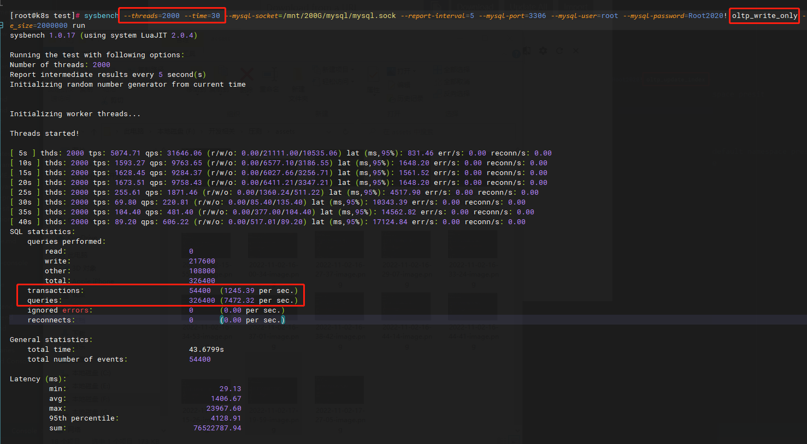
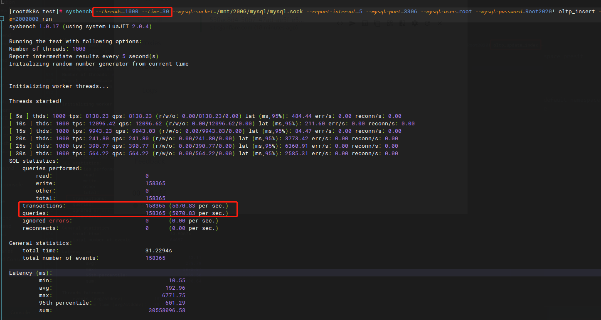
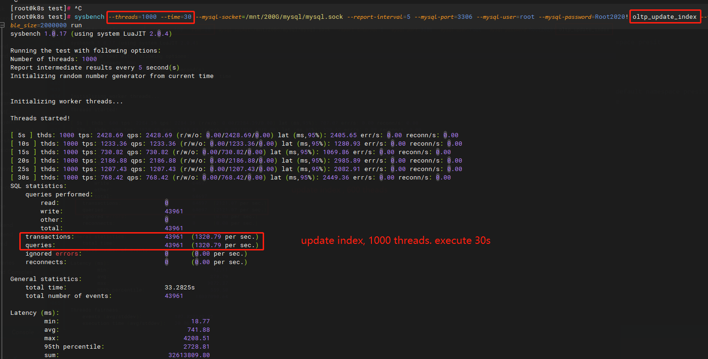

### Sysbench 数据库压测

#### 1. 压测前准备 - 内核参数配置

http://masikkk.com/article/sysbench/[sysbench-数据库基准测试工具](http://masikkk.com/article/sysbench/)

#### 1. 创建数据库 sbtest

#### 2. 准备10个table, 每个table 两百万数据：

```
 sysbench --mysql-port=3306 \
--mysql-socket=/mnt/200G/mysql/mysql.sock \
--mysql-user=root \
--mysql-password=Root2020!  \
/usr/share/sysbench/oltp_common.lua \
--tables=10 \
--table_size=2000000 \
prepare 
```

#### 3.修改 MySQL参数 instance=4， pool size=12G

```apacheconf
innodb_buffer_pool_instances = 4
innodb_buffer_pool_size = 12G
```

#### 4. 测试性能命令

```
# 1. 带索引更新
sysbench --threads=16 \
--time=60 \
--mysql-socket=/mnt/200G/mysql/mysql.sock \
--report-interval=5 \
--mysql-port=3306 \
--mysql-user=root \
--mysql-password=Root2020! \
oltp_update_index \
--tables=10 \
--table_size=2000000 \
run

# 2. 不带索引更新
sysbench --threads=3000 \
--time=20 \
--mysql-socket=/mnt/200G/mysql/mysql.sock \
--report-interval=5 \
--mysql-port=3306 \
--mysql-user=root \
--mysql-password=Root2020! \
oltp_update_non_index \
--tables=10 \
--table_size=2000000 \
run

# 3. 只写 
sysbench --threads=3000 \
--time=20 \
--mysql-socket=/mnt/200G/mysql/mysql.sock \
--report-interval=5 \
--mysql-port=3306 \
--mysql-user=root \
--mysql-password=Root2020! \
oltp_write_only \
--tables=10 \
--table_size=2000000 \
run

# 4. 只读
sysbench --threads=3000 \
--time=20 \
--mysql-socket=/mnt/200G/mysql/mysql.sock \
--report-interval=5 \
--mysql-port=3306 \
--mysql-user=root \
--mysql-password=Root2020! \
oltp_read_only \
--tables=10 \
--table_size=2000000 \
run

# 5. 插入
sysbench --threads=3000 \
--time=20 \
--mysql-socket=/mnt/200G/mysql/mysql.sock \
--report-interval=5 \
--mysql-port=3306 \
--mysql-user=root \
--mysql-password=Root2020! \
oltp_insert \
--tables=10 \
--table_size=2000000 \
run

6. 读写
sysbench --threads=3000 \
--time=20 \
--mysql-socket=/mnt/200G/mysql/mysql.sock \
--report-interval=5 \
--mysql-port=3306 \
--mysql-user=root \
--mysql-password=Root2020! \
oltp_read_write \
--tables=10 \
--table_size=2000000 \
run
```

#### 5. 测试结果 ( buffer instances=4, buffer pool size=12G )

##### 5.1 插入性能 (测试多次)

1. 2000 threads , 30s, tps -> 7119

2. 2000 threads , 30s, tps -> 3864

3. 2000 threads , 30s, tps -> 4606

4. 2000 threads , 30s, tps -> 4320

5. 1000 threads , 30s, tps -> 5070

6. 1000 threads , 30s, tps -> 1507

7. 1000 threads , 30s, tps -> 4138

##### 5.2 update 性能 (测试多次)

1. 2000 threads , 30s, tps -> 1440

2. 2000 threads , 30s, tps -> 1190

3. 2000 threads , 30s, tps -> 1254

4. 1000 threads , 30s, tps -> 2401

5. 1000 threads , 30s, tps -> 1320

6. 1000 threads , 30s, tps -> 2015

7. 600 threads , 30s, tps -> 887

8. 600 threads , 30s, tps -> 2179

9. 600 threads , 30s, tps -> 2121

10. 16 threads , 30s, tps -> 448

##### 5.3 write only 性能

- 2000 threads , 30s, tps -> 1245

- 2000 threads , 30s, tps -> 424

- 2000 threads , 30s, tps -> 743

- 1000 threads , 30s, tps -> 1342

- 1000 threads , 30s, tps -> 278

- 1000 threads , 30s, tps -> 505

- 1000 threads , 30s, tps -> 1513

- 1000 threads , 30s, tps -> 251

##### 5.4 read only 性能

- 1000 threads , 30s, tps -> 1933

- 1000 threads , 30s, tps -> 2874

- 1000 threads , 30s, tps -> 3171

- 2000 threads , 30s, tps -> 2812

- 2000 threads , 30s, tps -> 2885

- 2000 threads , 30s, tps -> 2881

#### 6. 测试结果 ( buffer instances=4, buffer pool size=12G )

##### 6.1 插入性能 (测试多次)

- 1000 threads , 30s, tps -> 3193

- 1000 threads , 30s, tps -> 2474

- 1000 threads , 30s, tps -> 2324

- 2000 threads , 30s, tps -> 6357

- 2000 threads , 30s, tps -> 5618

- 2000 threads , 30s, tps -> 4295

- 3000 threads , 30s, tps -> 3404

- 3000 threads , 30s, tps -> 3526

- 3000 threads , 30s, tps -> 2508

##### 6.2 update 性能 (测试多次)

- 1000 threads , 30s, tps -> 4291

- 1000 threads , 30s, tps ->716

- 1000 threads , 30s, tps ->1019

- 2000 threads , 30s, tps ->1715

- 2000 threads , 30s, tps ->814

- 2000 threads , 30s, tps ->1800

- 2000 threads , 30s, tps ->1312

##### 6.3 write only 性能 (测试多次)

- 2000 threads , 30s, tps -> 401

- 2000 threads , 30s, tps -> 636

- 2000 threads , 30s, tps -> 2127

- 2000 threads , 30s, tps -> 819

- 1000 threads , 30s, tps -> 546

- 1000 threads , 30s, tps -> 622

- 1000 threads , 30s, tps -> 453

##### 6.4 read only 性能 (测试多次)

- 200 threads , 30s, tps -> 3524

- 200 threads , 30s, tps -> 3522

- 800 threads , 30s, tps -> 2935

- 800 threads , 30s, tps -> 3093

- 2000 threads , 30s, tps -> 3040

- 2000 threads , 30s, tps -> 3181











#### 5. 常见问题 (trouble shooting)

##### 5.1 Can't create more than max_prepared_stmt_count statements (current value: 16382)

> max_prepared_stmt_count 参数限制了同一时间在 mysqld 上所有 session 中 prepared 语句的上限。 它的取值范围为 “0 - 1048576”，默认为 16382。
> 
>        mysql 对于超出 max_prepared_stmt_count 的 prepare 语句就会报 Can't create more than max_prepared_stmt_count statements (current value: 16382)" 错误。
> 
> 对于现场而言，可以先将这个值调大。
> 
> 直连后端 MySQL 执行如下命令。
> 
> mysql> SHOW GLOBAL STATUS LIKE 'com_stmt%';
> +-------------------------+--------+
> | Variable_name           | Value  |
> +-------------------------+--------+
> | Com_stmt_execute        | 435289 |
> | Com_stmt_close             | 0            |
> | Com_stmt_fetch             | 0            |
> | Com_stmt_prepare        | 46000   |
> | Com_stmt_reset             | 0            |
> | Com_stmt_send_long_data | 0      |
> | Com_stmt_reprepare      | 0      |
> +-------------------------+--------+
> 7 rows in set (0.00 sec)

> 查看如下 3 个参数值：
> 
> Com_stmt_close               prepare 语句关闭的次数
> 
> Com_stmt_execute           prepare 语句执行的次数
> 
> Com_stmt_prepare           prepare 语句创建的次数
> 
> 通过以下命令修改 max_prepared_stmt_count 的值（该值可动态修改，也可在配置文件中指定后重启服务生效）
> 
> mysql> set global max_prepared_stmt_count=100000;
